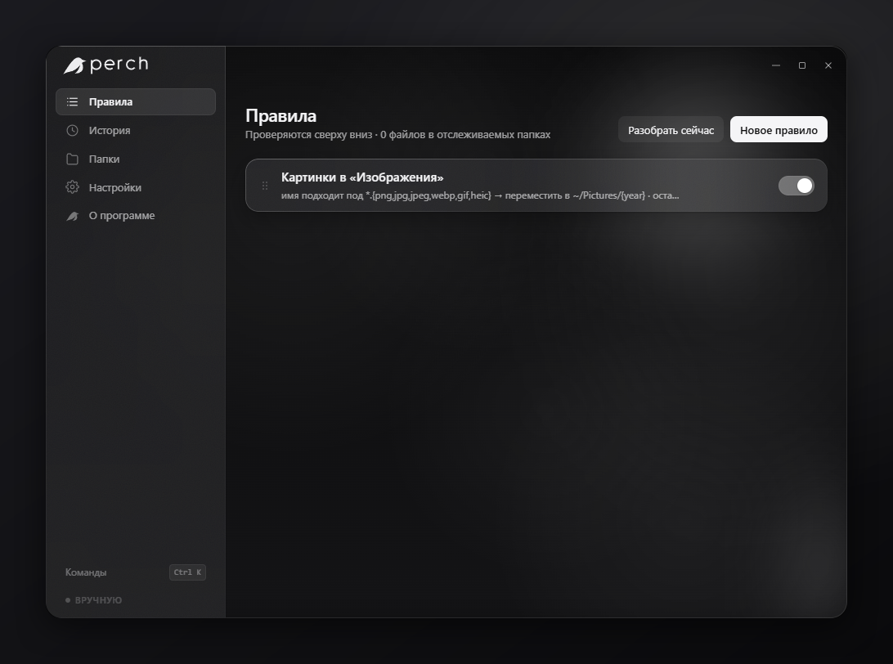

<p align="center">
  
</p>

<h1 align="center">Perch</h1>

<p align="center">
  <strong>Your folders, tidy, without you touching them.</strong><br />
  <sub>Русский и English · Windows · macOS · Linux · nothing leaves the machine</sub>
</p>

<p align="center">
  <a href="LICENSE"></a>
  <a href="https://github.com/Fuilex/perch/releases"></a>
  <a href="https://github.com/Fuilex/perch/actions"></a>
</p>

<p align="center">
  
</p>

Downloads folder full of installers, screenshots and half-read PDFs? Tell Perch
what belongs where, once. It watches the folders you choose and files things as
they land — locally, with no account, no cloud and no network calls at all.

It shows you what it plans to do before it does it, and everything it has done
can be undone, one file or a whole batch at a time.

## Как это работает

Правило это условие и что с ним делать. Условия соединяются через «и», правила
проверяются сверху вниз:

> **если** имя подходит под `Screenshot*` **и** файл старше 30 дней
> **тогда** перенести в `~/Pictures/Screenshots/{year}-{month}`

Дальше на выбор: разбирать автоматически, как только в папке что-то появилось,
или вручную кнопкой. Перед применением Perch показывает список файлов, и любой
можно снять галочкой. Всё, что сделано, лежит в истории и отменяется обратно.

Интерфейс на русском по умолчанию, английский переключается в настройках.
Начинать с пустого места не нужно: шесть готовых правил уже внутри.

## What it does

- **Conditions** — extension, name pattern, regex, size, age; combined with *and*
- **Actions** — move, copy, rename, or send to the recycle bin
- **Templates** — `{name}` `{ext}` `{year}` `{month}` `{day}` `{hour}` `{minute}` `{counter}` `{hash8}` `{source_folder}`, with missing folders created on the way
- **Dry run first** — every operation listed before it runs, each one deselectable
- **Undo** — journalled in SQLite; one file or a whole batch
- **Watched folders** — filesystem events with a settle delay, so half-written downloads are left alone
- **Drag and drop** — drop a folder on the window to start watching it
- **Quiet hours** — a daily window where nothing is organized automatically
- **Optional password** — a local profile locks the window and the commands behind it
- **Everything in the app** — no config file to hand-edit; Settings shows you where the files live anyway
- **JSON rules** — import, export, share, version-control
- **No telemetry** — zero network requests, no accounts, fully local

## Install

Grab an installer from [Releases](https://github.com/Fuilex/perch/releases):

| OS | File |
|----|------|
| Windows 10+ | `Perch_x.y.z_x64-setup.exe`, or the portable `perch.exe` |
| macOS 12+ | `Perch_x.y.z_aarch64.dmg` (Apple silicon) or `_x64.dmg` (Intel) |
| Linux | `.AppImage` or `.deb` |

### From source

```bash
npm install
npm run tauri dev
```

`npm run dev` on its own serves the interface in a browser for UI work. There is
no backend behind it, so the window says so and anything touching real files is
refused.

<details>
<summary><strong>Building on Windows</strong> — three traps worth knowing about</summary>

```powershell
powershell -ExecutionPolicy Bypass -File scripts/dev.ps1
powershell -ExecutionPolicy Bypass -File scripts/build.ps1
```

**Build for MSVC if you intend to give the result to anyone.** On the GNU
toolchain, `webview2-com` cannot link the WebView2 loader statically, so the
executable ends up importing `WebView2Loader.dll` at runtime. Cargo drops that
DLL next to the binary, which is why the build runs fine on the machine that made
it — but the installer does not carry it, and on someone else's computer the app
dies before it starts:

> Не удаётся продолжить выполнение кода, поскольку система не обнаружила
> WebView2Loader.dll

MSVC links it statically and the problem disappears:

```bash
npx tauri build --target x86_64-pc-windows-msvc
```

The release workflow already builds MSVC, so installers from a tagged release are
unaffected. Only hand-built GNU ones are.

MinGW on `PATH` is what the GNU toolchain needs for `windres`; the scripts put it
there.

The scripts refuse early if the project sits in a path containing non-ASCII
characters. `windres` cannot open files through such a path, and the error it
prints instead blames the icon, which sends you looking in the wrong place.

Output lands in `C:\perch-target\release\`: `perch.exe` to run directly, plus an
NSIS installer and an MSI under `bundle\`.

**Closing the window does not quit Perch.** It parks in the tray, and a running
instance holds `perch.exe` open — so the next build fails with *Access denied*.
Quit from the tray first.

**Windows caches file icons.** After the icon changes, Explorer keeps showing the
old one. Run `ie4uinit.exe -show`, or delete `%LOCALAPPDATA%\IconCache.db` and
restart Explorer.

</details>

<details>
<summary><strong>Cutting a release</strong></summary>

Tag a commit and push the tag. `.github/workflows/release.yml` builds installers
for Windows, both macOS architectures and Linux, then attaches them to a
**draft** release — publishing stays a manual step, so nothing appears on the
releases page until you press the button.

```bash
git tag v0.1.0
git push origin v0.1.0
```

The version in the filenames comes from `version` in `src-tauri/tauri.conf.json`,
so bump that in the same commit you tag.

</details>

## Rule format

Rules are stored as JSON, and Settings › Rules exports them in this shape. `id`
is required but gets replaced on import, so any UUID will do.

```json
{
  "version": 1,
  "rules": [
    {
      "id": "00000000-0000-4000-8000-000000000001",
      "name": "Archive old screenshots",
      "enabled": true,
      "conditions": [
        { "type": "Glob", "value": "Screenshot*" },
        { "type": "OlderThan", "value": 604800 }
      ],
      "action": {
        "type": "Move",
        "dest_template": "~/Pictures/Screenshots/{year}-{month}"
      },
      "stop_on_match": true,
      "order": 0
    }
  ]
}
```

Sizes are bytes, ages are seconds. The rule editor is easier — it shows how many
files a rule matches as you type. Full reference: [docs/rules.md](docs/rules.md).

## Your data

Everything sits in `Perch/` under the OS local data directory:

| File | What |
| --- | --- |
| `config.json` | Settings and watched folders |
| `rules.json` | Your rules |
| `journal.db` | SQLite history — what undo reads |
| `account.json` | Only if you set a password |

Settings › On disk shows the exact paths and opens them in the file manager.

### The password

Optional, and local. There is no server and no sync: signing in unlocks the app
on this machine. The password is stored as an Argon2id hash, and the Rust side
refuses every data command while the session is locked, so the lock screen is not
the only thing holding the door.

It **gates access; it does not encrypt.** The rules and history files stay
readable to anyone who can open the folder. Forgotten it? There is nothing to
reset it from — delete `account.json` and the lock is gone, rules untouched.

## Not implemented yet

Listed so nobody builds a rule on top of one:

- `Unzip` and `RunCommand` actions are accepted and recorded, but do nothing.
- The `MIME type`, `Is a duplicate` and `Max depth` conditions match every file,
  so the rule editor does not offer them.
- `src-tauri/src/cli` is a placeholder; there is no command-line interface yet.

## Where things are

| Path | What's in it |
| --- | --- |
| `src/lib/ipc.ts` | Every backend command, typed. The only file that talks to `@tauri-apps/api`. |
| `src/store/app.ts` | UI state. Mutations go out over IPC and store what comes back. |
| `src/lib/i18n.ts` | Both dictionaries. Russian is the source of truth; English is typed against it. |
| `src/lib/presets.ts` | The ready-made rules. |
| `src/screens/` | Rules, the rule editor, activity, folders, settings, lock screen. |
| `src/design/` | Tokens, the glass material, appearance settings, hover effects. |
| `src-tauri/src/core/` | Scanner, matcher, planner, executor, journal, templates, accounts. |
| `src-tauri/src/commands/` | The command surface the UI calls. |
| `scripts/gen-icons.mjs` | Builds the whole icon set from `src/assets/mark.svg` (`npm run icons`). |

Architecture notes: [docs/architecture.md](docs/architecture.md). Design
language: [docs/design-system.md](docs/design-system.md). `CHANGELOG.md` records
what changed and, where it matters, why.

## FAQ

**Is it safe?** Files are never deleted outright — the `Trash` action goes
through the system recycle bin. Every operation is journalled, and moves, renames
and copies can be undone from the Activity screen.

**Does it phone home?** No. Zero network requests, no telemetry, no accounts.

**Why another file organizer?** Because the good ones are paid and
Mac-only, and the free ones look it.

## Built with

[Tauri 2](https://tauri.app) · [Rust](https://rust-lang.org) ·
[React](https://react.dev) · [TypeScript](https://typescriptlang.org) ·
[Framer Motion](https://motion.dev)

Contributions welcome — see [CONTRIBUTING.md](CONTRIBUTING.md).

---

<p align="center"><sub>by <a href="https://github.com/Fuilex">Fuilex</a> · MIT License</sub></p>
