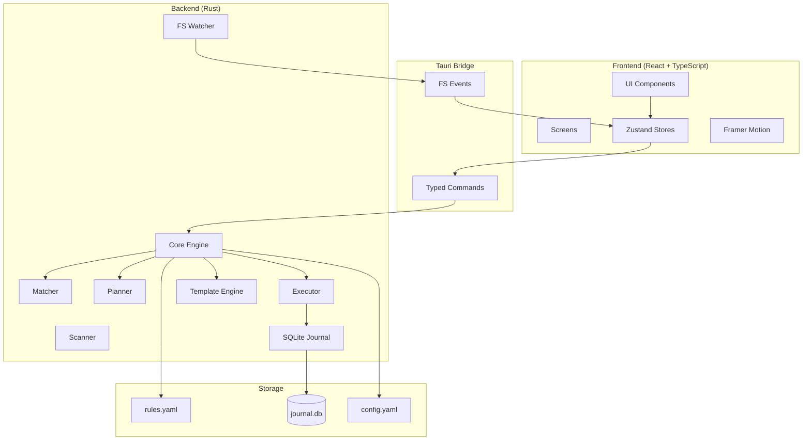

# Architecture

## System Overview

## Data Flow

1. **FS Event** → Watcher debounces → Scanner collects files
2. **Matcher** evaluates files against rules (top-to-bottom, stop-on-match)
3. **Planner** generates `PlannedOperation[]` (dry-run)
4. **Executor** performs atomic operations, records each in Journal
5. **Journal** enables full undo (single or batch)

## Key Principles

- All file logic in Rust — zero business logic in TypeScript
- Types generated from Rust via ts-rs — single source of truth
- Atomic operations: copy-then-delete, collision resolution
- Never delete without trash
- All state changes through Zustand stores
